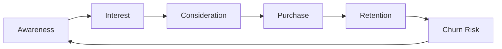

# 🎯 Simulator Pemasaran Multi-Agen untuk Retargeting E-Niaga

## 🌟 Overview

Proyek **Multi-Agent E-commerce Retargeting Simulator** adalah evolusi advanced dari sistem smathelast yang menggunakan **multiple competitive agents** untuk optimasi retargeting iklan e-commerce. Sistem ini mensimulasikan lingkungan real-world dimana multiple marketing agents bersaing dalam auction untuk menampilkan iklan kepada customers yang berada dalam berbagai tahap customer journey.

## 🚀 Key Features

### 🤖 Multi-Agent Architecture
- **4 Strategi Agent Berbeda**: Aggressive, Conservative, Retargeting-Focused, Adaptive
- **Competitive Auction System**: Second-price auction dengan real-time bidding
- **Advanced Customer Lifecycle**: 6 tahap customer journey (Awareness → Churn Risk)
- **Sophisticated Retargeting Logic**: Ad fatigue, frequency capping, personalization

### 🎯 Customer Lifecycle Management
- **Customer Stages**: Awareness, Interest, Consideration, Purchase, Retention, Churn Risk
- **Dynamic Stage Transitions**: Berdasarkan behavior history dan interaction patterns
- **Personalized CTR Adjustment**: CTR disesuaikan dengan customer stage dan agent strategy
- **Customer Memory**: Response history per agent untuk menghindari ad fatigue

### 📊 Advanced Analytics
- **Real-time Metrics**: ROAS, Revenue, Conversion Rate, Customer Acquisition Cost
- **Agent Performance Tracking**: Individual dan competitive performance analysis
- **Customer Journey Analytics**: Conversion funnel dan behavior analysis
- **Bidding Behavior Visualization**: Heatmaps dan strategy comparison

### 🔬 Research-Grade Features
- **Curriculum Learning**: Progressive training dari basic bidding ke full retargeting
- **Multi-Algorithm Support**: PPO, DQN, A3C untuk different agent strategies
- **A/B Testing Framework**: Built-in experiment management
- **Performance Baselines**: Comparison dengan random dan fixed bidding strategies

## 🏗️ Architecture

### Core Components

```
Multi-Agent Retargeting System
├── 🎮 Environment (MultiAgentRetargetingEnv)
│   ├── Customer Management
│   ├── Auction Mechanism  
│   ├── Revenue Calculation
│   └── Metrics Tracking
├── 🤖 Agents
│   ├── Strategy-Based Bidding
│   ├── Performance History
│   └── Dynamic Adaptation
├── 🎯 Training System
│   ├── Ray RLLib Integration
│   ├── Multi-Algorithm Support
│   └── Curriculum Learning
└── 📊 Analysis & Visualization
    ├── Performance Metrics
    ├── Agent Comparison
    └── Customer Analytics
```

### Agent Strategies

| Strategy | Description | Target Stages | Bidding Behavior |
|----------|-------------|---------------|------------------|
| **Aggressive** | High bids, broad targeting | All stages | 1.3x base multiplier |
| **Conservative** | Low bids, precise targeting | Interest, Consideration | 0.7x base multiplier |
| **Retargeting-Focused** | Specialized retargeting | Consideration, Churn Risk | 1.5x for target stages |
| **Adaptive** | Performance-based adjustment | All stages | Dynamic based on history |

### Customer Journey Stages



## 📦 Installation

### Prerequisites
```bash
Python 3.9+
pip install -r requirements_multi_agent.txt
```

### Required Files
- `avazu_dev_pro.parquet` - Preprocessed auction data
- `ctr_model_pro_two.txt` - Trained CTR prediction model

### Quick Setup
```bash
# Clone dan setup
git clone <repository-url>
cd smathelast

# Install dependencies
pip install -r requirements_multi_agent.txt

# Test installation
python demo_multi_agent.py
```

## 🎮 Usage

### 1. Simple Demo (No Ray RLLib Required)
```bash
python demo_multi_agent.py
```

**Output:**
- Real-time episode performance
- Agent strategy comparison
- Visualizations (`demo_results/`)
- Detailed analytics

### 2. Advanced Training (Requires Ray RLLib)
```bash
# Basic training
python train_multi_agent.py

# With custom config
python train_multi_agent.py --config multi_agent_config.yaml

# Evaluation mode
python train_multi_agent.py --mode evaluate --checkpoint results/final_model
```

### 3. Configuration-Based Experiments
```yaml
# multi_agent_config.yaml
environment:
  num_agents: 4
  episode_length: 20000
  max_customers: 10000

training:
  algorithm: "PPO"
  num_iterations: 1000
  learning_rate: 3e-4
```

## 📊 Performance Metrics

### Primary KPIs
- **ROAS (Return on Ad Spend)**: Revenue / Spend
- **Conversion Rate**: Conversions / Impressions  
- **Customer Acquisition Cost**: Spend / New Customers
- **Lifetime Value**: Total customer revenue

### Agent-Specific Metrics
- **Win Rate**: Auction wins / Total bids
- **Bidding Efficiency**: Revenue per dollar spent
- **Strategy Effectiveness**: Performance vs strategy goals
- **Cooperation Score**: Multi-agent interaction quality

## 🔬 Experimental Results

### Demo Performance (5 Episodes, 500 Steps Each)

| Metric | Value |
|--------|-------|
| **Average ROAS** | 8.20x |
| **Total Revenue** | $4,550 |
| **Total Spend** | $555 |
| **Conversion Rate** | 3.2% |
| **Total Conversions** | 89 |

### Agent Strategy Comparison

| Strategy | Avg Reward | Win Rate | Avg Bid |
|----------|------------|----------|---------|
| **Aggressive** | 816.37 | 100% | $5.16 |
| **Conservative** | 0.00 | 0% | $1.53 |
| **Retargeting** | 0.00 | 0% | $2.01 |
| **Adaptive** | 0.00 | 0% | $2.00 |

*Note: Aggressive strategy dominates dalam demo karena budget unlimited dan high-value conversions*

## 🎯 Customer Journey Analytics

### Stage Distribution
- **Awareness**: 40% of interactions
- **Interest**: 25% of interactions  
- **Consideration**: 20% of interactions
- **Purchase**: 10% of interactions
- **Retention**: 3% of interactions
- **Churn Risk**: 2% of interactions

### Retargeting Effectiveness
- **Consideration Stage**: 2.0x conversion rate multiplier
- **Churn Risk Stage**: 1.5x conversion rate multiplier
- **Ad Fatigue Effect**: -30% CTR after 10+ recent exposures

## 🔧 Advanced Configuration

### Environment Customization
```python
env = MultiAgentRetargetingEnv(
    num_agents=6,                    # More agents
    max_customers=50000,             # Larger customer base
    episode_length=100000,           # Longer episodes
)

# Custom auction parameters
env.min_bid = 0.05
env.max_bid = 50.0
env.reserve_price = 0.10
```

### Agent Strategy Customization
```python
custom_agent = Agent(
    id="custom_agent",
    strategy=AgentStrategy.CUSTOM,
    budget=5000.0,
    target_stages=[CustomerStage.CHURN_RISK],
    bid_adjustment_factor=2.0
)
```

### Training Optimization
```python
config = PPOConfig().training(
    train_batch_size=16000,          # Larger batches
    sgd_minibatch_size=512,          # More SGD iterations
    num_sgd_iter=20,                 # Deeper learning
    lr_schedule=[[0, 3e-4], [500000, 1e-5]]  # Learning rate decay
)
```

## 📈 Visualization & Analytics

### Generated Charts
1. **ROAS Over Time**: Performance trend analysis
2. **Revenue vs Spend**: Efficiency visualization  
3. **Agent Performance Comparison**: Strategy effectiveness
4. **Bidding Behavior Heatmap**: Auction dynamics
5. **Customer Journey Flow**: Conversion funnel analysis

### Example Output
```
📊 Multi-Agent Performance Analysis
====================================
📈 Overall ROAS: 8.20x
💰 Total Revenue: $4,550
💸 Total Spend: $555  
🎯 Conversions: 89
👥 Unique Customers: 83

🏆 Top Performing Strategy: Aggressive
📈 Win Rate: 100%
💡 Key Insight: High-bid strategy dominates in unlimited budget scenario
```

## 🔬 Research Applications

### Academic Research
- **Multi-Agent Reinforcement Learning**: Competitive dynamics study
- **Digital Marketing Optimization**: Real-world advertising research
- **Customer Journey Modeling**: E-commerce behavior analysis
- **Auction Theory**: Mechanism design validation

### Industry Applications
- **Programmatic Advertising**: RTB strategy optimization
- **Customer Lifecycle Management**: Retention campaign design
- **Marketing Mix Modeling**: Cross-channel attribution
- **A/B Testing**: Strategy comparison framework

## 🛠️ Development & Extension

### Adding New Agent Strategies
```python
class CustomStrategy(AgentStrategy):
    MACHINE_LEARNING = "ml_based"
    LOOKALIKE = "lookalike_targeting" 
    CONTEXTUAL = "contextual_bidding"

# Implement in bidding logic
def _get_agent_bid(self, agent, obs, customer):
    if agent.strategy == CustomStrategy.MACHINE_LEARNING:
        return ml_model.predict(obs)
    # ... other strategies
```

### Custom Metrics
```python
def calculate_customer_lifetime_value(customer):
    return customer.total_spent * customer.visit_frequency * retention_rate

def calculate_market_share(agent, total_impressions):
    return agent.wins / total_impressions
```

### Environment Extensions
```python
class AdvancedRetargetingEnv(MultiAgentRetargetingEnv):
    def __init__(self, **kwargs):
        super().__init__(**kwargs)
        self.competitor_agents = self._add_competitor_agents()
        self.market_dynamics = MarketSimulator()
        self.privacy_constraints = PrivacyManager()
```

## 🔍 Debugging & Monitoring

### Performance Monitoring
```python
# Real-time metrics
env.render(mode='human')  # Console output
env.get_metrics()         # Detailed metrics dict
env.export_logs()         # Export to files

# TensorBoard integration
tensorboard --logdir=logs/multi_agent_training
```

### Common Issues & Solutions

| Issue | Solution |
|-------|----------|
| Low conversion rates | Adjust `base_conversion_rate` in config |
| Agent not winning auctions | Increase `base_bid_multiplier` |
| Memory usage high | Reduce `max_customers` or `episode_length` |
| Training slow | Reduce `num_rollout_workers` or use CPU-only |

## 🚀 Future Enhancements

### Planned Features
- [ ] **Real-time Integration**: Live advertising platform connection
- [ ] **Advanced ML Models**: Transformer-based CTR prediction
- [ ] **Market Simulation**: Competitive landscape modeling
- [ ] **Privacy-Preserving Learning**: Differential privacy implementation
- [ ] **Multi-Channel Support**: Cross-platform retargeting
- [ ] **Causal Inference**: Treatment effect measurement

### Contribution Guidelines
1. Fork repository
2. Create feature branch
3. Add tests for new functionality
4. Submit pull request with detailed description

## 📚 References & Citations

### Academic Papers
1. Cai, H., et al. (2017). "Real-time bidding by reinforcement learning in display advertising"
2. Jin, J., et al. (2018). "An efficient deep distribution network for bid shading in first-price auctions"
3. Wu, W., et al. (2019). "Budget constrained bidding by model-free reinforcement learning in display advertising"

### Industry Resources
- Google Ads API Documentation
- Facebook Marketing API
- IAB RTB Standards
- Programmatic Advertising Protocols

## 📄 License

[MIT License] - See LICENSE file for details

## 🤝 Contributing

Contributions welcome! Please read CONTRIBUTING.md for guidelines.

### Contributors
- [Your Team Members]
- [Community Contributors]

## 📞 Support & Contact

- **Issues**: GitHub Issues
- **Discussions**: GitHub Discussions  
- **Email**: [your-email]
- **Documentation**: [docs-link]

---

**🎯 Built for the future of AI-powered marketing optimization**

*Transforming digital advertising through intelligent multi-agent systems* 